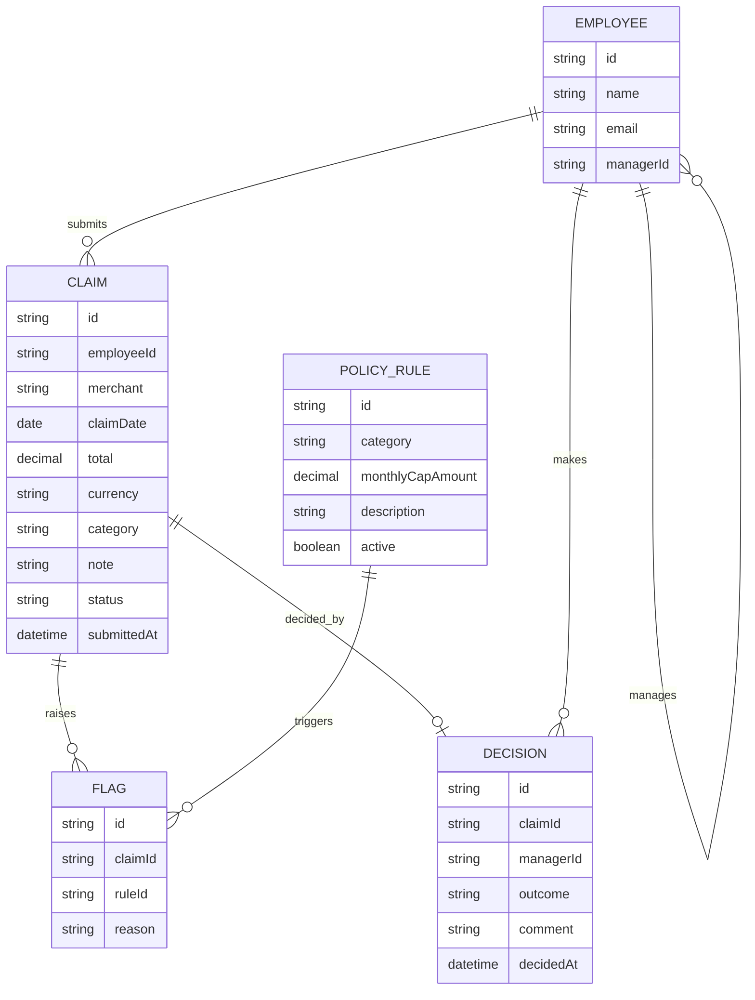

# Domain Model

The core entities: employees and their managers, expense claims read from a
receipt, the policy rules a claim is checked against, and the flags a claim
raises when it breaks one.

- **EMPLOYEE** — every signed-in user; `managerId` (self-referencing) defines
the manager/team relationship a Manager's queue and a Finance/Admin's
organization-wide view read from.
- **CLAIM** — one expense claim; `category` is one of meals, travel,
accommodation, office supplies, other; `status` is submitted, approved or
rejected.
- **FLAG** — a plain-language reason a claim broke a `POLICY_RULE`, computed
at submission.
- **POLICY\_RULE** — a per-category monthly cap Finance/Admin maintains.
- **DECISION** — a manager's approve/reject outcome and comment on a claim.