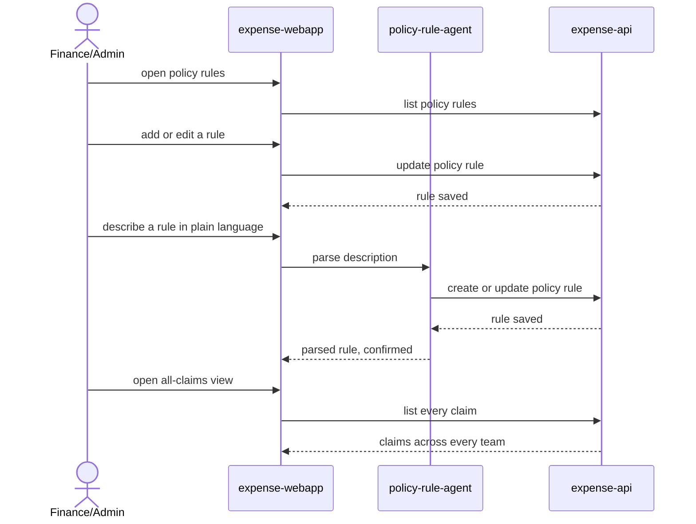

# Finance/Admin maintains policy and views spend

Finance/Admin edits the spending policy's limits — by form or by typing a
plain-language description — and sees claims across every team.

```mermaid
sequenceDiagram
    actor FinanceAdmin as Finance/Admin
    participant expense-webapp
    participant policyagent as policy-rule-agent
    participant expense-api

    FinanceAdmin->>expense-webapp: open policy rules
    expense-webapp->>expense-api: list policy rules
    FinanceAdmin->>expense-webapp: add or edit a rule
    expense-webapp->>expense-api: update policy rule
    expense-api-->>expense-webapp: rule saved
    FinanceAdmin->>expense-webapp: describe a rule in plain language
    expense-webapp->>policyagent: parse description
    policyagent->>expense-api: create or update policy rule
    expense-api-->>policyagent: rule saved
    policyagent-->>expense-webapp: parsed rule, confirmed
    FinanceAdmin->>expense-webapp: open all-claims view
    expense-webapp->>expense-api: list every claim
    expense-api-->>expense-webapp: claims across every team
```

