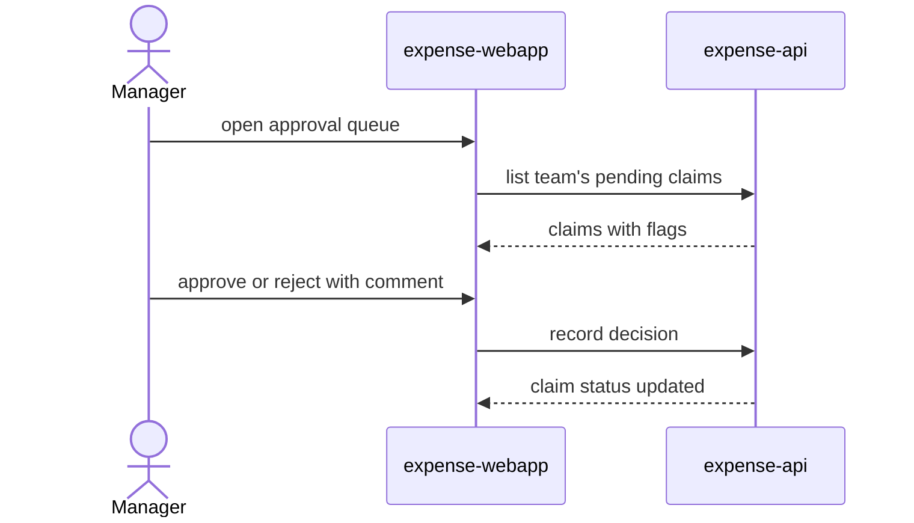

# Manager reviews and decides a claim

A Manager sees pending claims from their own team, with any policy flags,
and approves or rejects each with a comment.

```mermaid
sequenceDiagram
    actor Manager
    participant expense-webapp
    participant expense-api

    Manager->>expense-webapp: open approval queue
    expense-webapp->>expense-api: list team's pending claims
    expense-api-->>expense-webapp: claims with flags
    Manager->>expense-webapp: approve or reject with comment
    expense-webapp->>expense-api: record decision
    expense-api-->>expense-webapp: claim status updated
```

