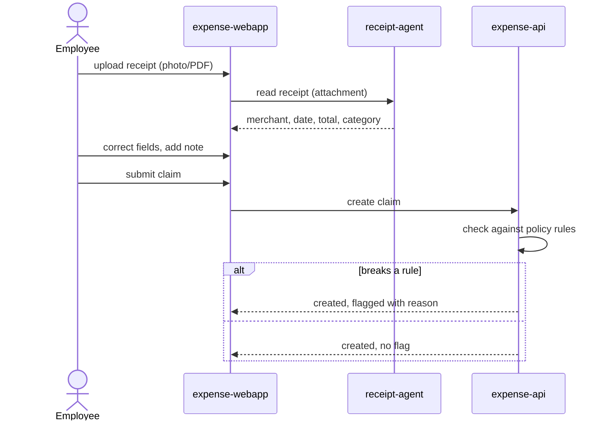

# Employee submits an expense claim

An Employee uploads a receipt, the fields are read automatically, they
correct and annotate it, and the claim is checked against policy on submit.

```mermaid
sequenceDiagram
    actor Employee
    participant expense-webapp
    participant receipt-agent
    participant expense-api

    Employee->>expense-webapp: upload receipt (photo/PDF)
    expense-webapp->>receipt-agent: read receipt (attachment)
    receipt-agent-->>expense-webapp: merchant, date, total, category
    Employee->>expense-webapp: correct fields, add note
    Employee->>expense-webapp: submit claim
    expense-webapp->>expense-api: create claim
    expense-api->>expense-api: check against policy rules
    alt breaks a rule
        expense-api-->>expense-webapp: created, flagged with reason
    else
        expense-api-->>expense-webapp: created, no flag
    end
```